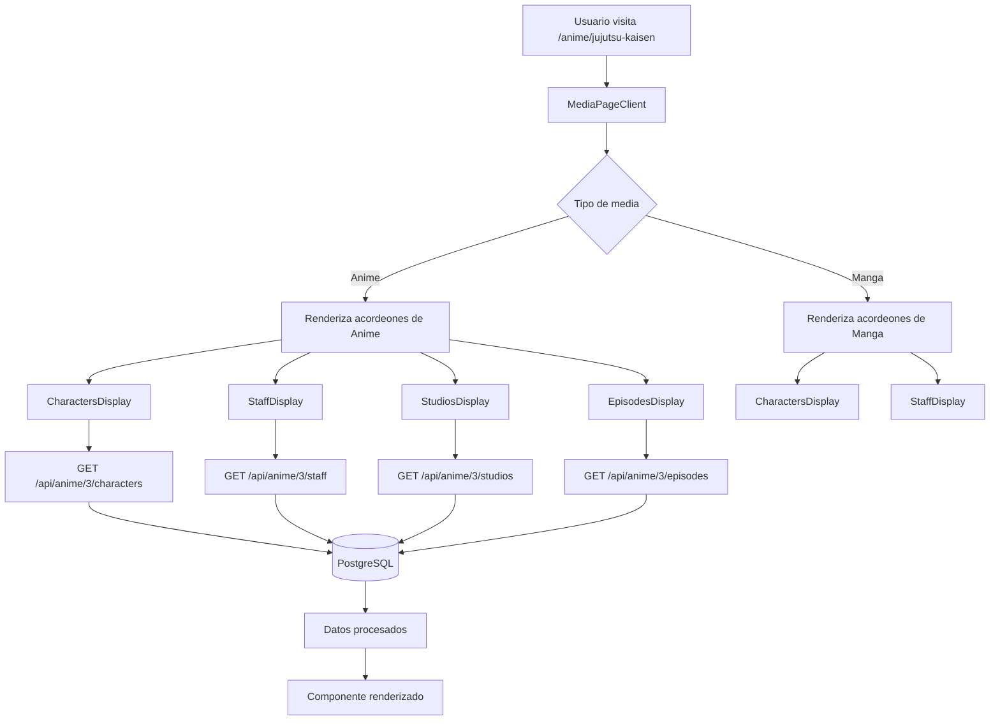

# 🎯 Sistema Completo de Anime/Manga - Documentación Técnica

## 📋 Resumen Ejecutivo

Se ha implementado un sistema completo para mostrar **personajes**, **staff**, **episodios** y **estudios** en las páginas de anime y manga, utilizando una arquitectura polimórfica que permite relaciones flexibles entre diferentes tipos de contenido.

---

## 🗂️ Arquitectura de Base de Datos

### Relaciones Polimórficas

El sistema utiliza tablas pivote polimórficas que permiten relacionar entidades con múltiples tipos de contenido:

```sql
-- Personajes pueden estar en: anime, manga, novel
characterable_characters (
  character_id INTEGER,
  characterable_type VARCHAR(20),  -- 'anime' | 'manga' | 'novel'
  characterable_id INTEGER,
  role VARCHAR(50)  -- 'main' | 'supporting'
)

-- Staff puede trabajar en: anime, manga, novel
staffable_staff (
  staff_id INTEGER,
  staffable_type VARCHAR(20),  -- 'anime' | 'manga' | 'novel'
  staffable_id INTEGER,
  role VARCHAR(100)  -- 'Director', 'Original Creator', etc.
)

-- Estudios pueden producir: anime, manga, novel
studiable_studios (
  studio_id INTEGER,
  studiable_type VARCHAR(20),  -- 'anime' | 'manga' | 'novel'
  studiable_id INTEGER,
  is_main_studio BOOLEAN
)

-- Episodios solo para anime
episodes (
  id BIGSERIAL,
  anime_id BIGINT,
  episode_number INTEGER,
  title VARCHAR(500),
  synopsis TEXT,
  air_date DATE,
  duration INTEGER,
  is_filler BOOLEAN,
  is_recap BOOLEAN
)
```

### Ventajas de la Arquitectura Polimórfica

✅ **Reutilización**: Un personaje puede aparecer en anime, manga y novela sin duplicar datos
✅ **Flexibilidad**: Fácil agregar nuevos tipos de contenido (ej: light novels, webtoons)
✅ **Normalización**: Evita redundancia de datos
✅ **Escalabilidad**: Crece con nuevas relaciones sin cambiar schema

---

## 🔌 API Endpoints Creados

### 1. **Personajes**

#### GET `/api/anime/[id]/characters`
**Descripción**: Obtiene personajes de un anime específico

**Response**:
```json
{
  "success": true,
  "data": {
    "main": [
      {
        "id": 1,
        "name": "Yuji Itadori",
        "name_romaji": "Yuji Itadori",
        "name_native": "虎杖悠仁",
        "description": "...",
        "image_url": "...",
        "role": "main"
      }
    ],
    "supporting": [...],
    "total": 10,
    "mainCount": 5,
    "supportingCount": 5
  }
}
```

**Características**:
- ✅ Separa personajes principales y secundarios
- ✅ Incluye nombres en romaji y nativo
- ✅ Ordenado por rol (main primero)
- ✅ Validación de ID y existencia del anime

#### GET `/api/manga/[id]/characters`
**Idéntico a la API de anime**, pero para manga

---

### 2. **Staff & Producción**

#### GET `/api/anime/[id]/staff`
**Descripción**: Obtiene el staff de un anime específico

**Response**:
```json
{
  "success": true,
  "data": [
    {
      "id": 2,
      "name_romaji": "Gege Akutami",
      "name_native": "芥見下々",
      "description": "...",
      "image_url": "...",
      "role": "Original Creator"
    },
    {
      "id": 4,
      "name_romaji": "Sunghoo Park",
      "role": "Director"
    }
  ],
  "total": 5
}
```

**Roles soportados**:
- Original Creator
- Director
- Series Composition
- Character Design
- Music
- Art Director
- Sound Director
- Chief Animation Director
- _y cualquier rol personalizado_

#### GET `/api/manga/[id]/staff`
**Idéntico a la API de anime**, pero para manga

---

### 3. **Episodios**

#### GET `/api/anime/[id]/episodes`
**Descripción**: Obtiene los episodios de un anime

**Response**:
```json
{
  "success": true,
  "data": [
    {
      "id": 1,
      "anime_id": 3,
      "episode_number": 1,
      "title": "Ryomen Sukuna",
      "title_romaji": "Ryomen Sukuna",
      "title_japanese": "両面宿儺",
      "synopsis": "Yuji Itadori es un estudiante...",
      "air_date": "2020-10-03",
      "duration": 24,
      "thumbnail_url": null,
      "video_url": null,
      "is_filler": false,
      "is_recap": false
    }
  ],
  "total": 10
}
```

**Características**:
- ✅ Ordenado por número de episodio
- ✅ Títulos en múltiples idiomas
- ✅ Badges para filler y recap
- ✅ Sinopsis expandible
- ✅ Fecha de emisión y duración

---

### 4. **Estudios de Animación**

#### GET `/api/anime/[id]/studios`
**Descripción**: Obtiene los estudios que produjeron un anime

**Response**:
```json
{
  "success": true,
  "data": [
    {
      "id": 2,
      "name": "MAPPA",
      "description": "...",
      "established_date": "2011-06-14",
      "website_url": "https://www.mappa.co.jp",
      "logo_url": "...",
      "is_main_studio": true
    }
  ],
  "total": 1
}
```

**Características**:
- ✅ Distingue estudio principal de colaboradores
- ✅ Incluye información corporativa
- ✅ Links a sitio web oficial
- ✅ Ordenado por importancia (main primero)

---

## 🎨 Componentes React Creados

### 1. **CharactersDisplay** (`characters-display.tsx`)

**Propósito**: Muestra personajes principales y secundarios en grid responsivo

**Props**:
```typescript
interface CharactersDisplayProps {
  mediaId: number;
  mediaType: 'anime' | 'manga';
}
```

**Características**:
- 📱 Grid responsivo: 2 cols (mobile) → 5 cols (xl)
- 🎯 Separación visual entre principales y secundarios
- 🏷️ Badges de rol (Principal/Secundario)
- 🖼️ Imágenes con aspect ratio 2:3
- ⚡ Estados de loading con Skeleton
- 🔄 Hover effects y transiciones

**Secciones**:
1. **Personajes Principales**: Grid con caracteres main
2. **Personajes Secundarios**: Grid con caracteres supporting

---

### 2. **StaffDisplay** (`staff-display.tsx`)

**Propósito**: Muestra equipo de producción con roles

**Props**:
```typescript
interface StaffDisplayProps {
  mediaId: number;
  mediaType: 'anime' | 'manga';
}
```

**Características**:
- 👥 Avatares circulares (64x64px)
- 🎭 Badge con rol de cada miembro
- 📋 Grid de 2 columnas (1 en mobile)
- 🌐 Nombres en romaji y nativo
- 🎨 Cards con hover effect
- ⚡ Loading skeletons

**Layout**:
```
┌──────────────────────────────────┐
│ [Avatar] Name Romaji             │
│          Name Native             │
│          [Role Badge]            │
└──────────────────────────────────┘
```

---

### 3. **EpisodesDisplay** (`episodes-display.tsx`)

**Propósito**: Lista interactiva de episodios con sinopsis expandible

**Props**:
```typescript
interface EpisodesDisplayProps {
  animeId: number;
}
```

**Características**:
- 📺 Número de episodio en círculo destacado
- 📅 Fecha de emisión formateada (español)
- ⏱️ Duración en minutos
- 🏷️ Badges: Filler, Recap
- 📖 Sinopsis expandible al click
- 🎨 Separadores visuales
- ⚡ Estados de loading

**Interactividad**:
- Click en episodio → Expande/Contrae sinopsis
- Formato de fecha: "17 de octubre, 2020"

---

### 4. **StudiosDisplay** (`studios-display.tsx`)

**Propósito**: Muestra estudios de animación con información corporativa

**Props**:
```typescript
interface StudiosDisplayProps {
  animeId: number;
}
```

**Características**:
- 🏢 Logo del estudio (64x64px)
- 🏆 Badge "Principal" para main studio
- 🔗 Link a sitio web oficial
- 📝 Descripción del estudio
- 🎨 Cards con hover effect

**Layout**:
```
┌────────────────────────────────────┐
│ [Logo]  Studio Name    [Principal] │
│         Description...             │
│         🔗 Sitio web oficial        │
└────────────────────────────────────┘
```

---

## 🔄 Integración en MediaPageClient

### Ubicación de Acordeones

Los nuevos componentes se agregaron como acordeones en `media-page-client.tsx`:

```tsx
<Accordion type="multiple" className="w-full space-y-4">
  {/* 1. Personajes (placeholder legacy) */}
  <AccordionItem value="characters">
    <CharactersCard characters={characters} />
  </AccordionItem>

  {/* 2. ✨ NUEVO: Personajes Reales */}
  <AccordionItem value="characters-real">
    <CharactersDisplay 
      mediaId={mediaData.id} 
      mediaType={reviewableType === 'anime' ? 'anime' : 'manga'} 
    />
  </AccordionItem>

  {/* 3. ✨ NUEVO: Staff & Producción */}
  <AccordionItem value="staff">
    <StaffDisplay 
      mediaId={mediaData.id} 
      mediaType={reviewableType === 'anime' ? 'anime' : 'manga'} 
    />
  </AccordionItem>

  {/* 4. ✨ NUEVO: Estudios (solo anime) */}
  {showEpisodes && (
    <AccordionItem value="studios">
      <StudiosDisplay animeId={mediaData.id} />
    </AccordionItem>
  )}

  {/* 5. ✨ NUEVO: Lista de Episodios (solo anime) */}
  {showEpisodes && (
    <AccordionItem value="episodes-real">
      <EpisodesDisplay animeId={mediaData.id} />
    </AccordionItem>
  )}

  {/* 6. Episodios (placeholder legacy) */}
  {showEpisodes && (
    <AccordionItem value="episodes">
      <EpisodesCard episodes={episodes} />
    </AccordionItem>
  )}

  {/* ... resto de acordeones ... */}
</Accordion>
```

### Lógica de Visibilidad

```typescript
// Determinar si mostrar componentes de anime
const showEpisodes = type === 'Anime' || type === 'Dougua';

// Mapear tipo de media a tipo de DB
const reviewableType = (() => {
  const typeMap: Record<string, 'anime' | 'manga' | 'novel'> = {
    'Anime': 'anime',
    'Dougua': 'anime',
    'Manga': 'manga',
    'Manhua': 'manga',
    'Manwha': 'manga',
    'Fan Comic': 'manga',
    'Novela': 'novel',
  };
  return typeMap[type] || 'anime';
})();
```

---

## 📊 Datos de Prueba - Jujutsu Kaisen

### Anime ID: 3

**Personajes** (10 totales):
- **Principales (5)**:
  - Yuji Itadori
  - Megumi Fushiguro
  - Nobara Kugisaki
  - Satoru Gojo
  - Ryomen Sukuna

- **Secundarios (5)**:
  - Maki Zenin
  - Toge Inumaki
  - Panda
  - Kento Nanami
  - Suguru Geto

**Staff (5 miembros)**:
- Gege Akutami - Original Creator
- Sunghoo Park - Director
- Hiroshi Seko - Series Composition
- Tadashi Hiramatsu - Character Design
- Yoshimasa Terui - Music

**Estudio**:
- MAPPA (Principal)

**Episodios** (10 registrados):
1. Ryomen Sukuna - 2020-10-03
2. For Myself - 2020-10-10
3. Girl of Steel - 2020-10-17
4. Curse Womb Must Die - 2020-10-24
5. Curse Womb Must Die -II- - 2020-10-31
6. After Rain - 2020-11-07
7. Assault - 2020-11-14
8. Boredom - 2020-11-21
9. Small Fry and Reverse Retribution - 2020-11-28
10. Idle Transfiguration - 2020-12-05

### Manga ID: 2

**Personajes** (10 totales):
- Mismos personajes que el anime

**Staff** (1 miembro):
- Gege Akutami - Story & Art

---

## 🚀 Flujo de Datos



---

## 🎯 Casos de Uso

### 1. **Agregar un nuevo personaje a un anime**

```sql
-- 1. Crear personaje
INSERT INTO app.characters (name, name_romaji, name_native, image_url)
VALUES ('Megumi Fushiguro', 'Megumi Fushiguro', '伏黒恵', 'https://...');

-- 2. Relacionar con anime
INSERT INTO app.characterable_characters (character_id, characterable_type, characterable_id, role)
VALUES (11, 'anime', 3, 'main');

-- 3. Relacionar con manga (mismo personaje)
INSERT INTO app.characterable_characters (character_id, characterable_type, characterable_id, role)
VALUES (11, 'manga', 2, 'main');
```

**Resultado**: El personaje aparece automáticamente en ambas páginas

---

### 2. **Agregar un nuevo staff member**

```sql
-- 1. Crear staff
INSERT INTO app.staff (name_romaji, name_native)
VALUES ('Yoshimasa Terui', '照井順政');

-- 2. Relacionar con anime
INSERT INTO app.staffable_staff (staff_id, staffable_type, staffable_id, role)
VALUES (7, 'anime', 3, 'Music');

-- 3. Si trabaja en otro anime
INSERT INTO app.staffable_staff (staff_id, staffable_type, staffable_id, role)
VALUES (7, 'anime', 5, 'Music');
```

**Resultado**: El staff aparece en ambos animes con el mismo perfil

---

### 3. **Agregar un nuevo episodio**

```sql
INSERT INTO app.episodes (
  anime_id, episode_number, title, title_romaji, synopsis, air_date, duration, is_filler
) VALUES (
  3, 11, 'Narrow-minded', 'Narrow-minded', 
  'Yuji y Nanami continúan su investigación...', 
  '2020-12-12', 24, false
);
```

**Resultado**: Aparece automáticamente en la lista de episodios

---

## 🔍 Consultas SQL Útiles

### Ver todos los personajes de un anime con su rol
```sql
SELECT 
  c.name, 
  cc.role,
  cc.characterable_type AS medio
FROM app.characterable_characters cc
JOIN app.characters c ON c.id = cc.character_id
WHERE cc.characterable_id = 3
ORDER BY cc.role, c.name;
```

### Ver todo el staff de múltiples proyectos
```sql
SELECT 
  s.name_romaji,
  ss.role,
  ss.staffable_type AS medio,
  ss.staffable_id AS medio_id
FROM app.staffable_staff ss
JOIN app.staff s ON s.id = ss.staff_id
WHERE s.id = 2  -- Gege Akutami
ORDER BY ss.staffable_type, ss.staffable_id;
```

### Contar personajes por rol en todos los animes
```sql
SELECT 
  a.title_romaji,
  cc.role,
  COUNT(*) AS total
FROM app.characterable_characters cc
JOIN app.anime a ON a.id = cc.characterable_id
WHERE cc.characterable_type = 'anime'
GROUP BY a.title_romaji, cc.role
ORDER BY a.title_romaji, cc.role;
```

---

## ✅ Checklist de Implementación

- [x] ✅ Crear tabla `episodes`
- [x] ✅ Crear API endpoints (characters, staff, episodes, studios)
- [x] ✅ Crear componentes React con Skeleton loaders
- [x] ✅ Integrar en MediaPageClient
- [x] ✅ Poblar base de datos con Jujutsu Kaisen
- [x] ✅ Probar queries SQL
- [x] ✅ Documentar arquitectura polimórfica
- [ ] 🔄 Probar en navegador
- [ ] 📝 Agregar más datos de prueba
- [ ] 🎨 Refinar estilos y UX
- [ ] 🔒 Agregar permisos de edición

---

## 🎨 Diseño Visual

### Paleta de Colores (siguiendo shadcn/ui)
- **Primary**: Basado en theme del usuario
- **Secondary**: Rol de personaje secundario
- **Muted**: Texto descriptivo
- **Border**: Separadores y cards

### Iconos utilizados (lucide-react)
- `Users` - Personajes
- `Briefcase` - Staff
- `PlayCircle` - Episodios
- `Building2` - Estudios
- `Calendar` - Fechas
- `Clock` - Duración

### Espaciado
- Gap entre cards: `gap-4`
- Padding interno: `p-4`
- Espacio entre secciones: `space-y-6`

---

## 🚨 Notas Importantes

### Manejo de Errores
Todos los componentes manejan 3 estados:
1. **Loading**: Skeleton loaders
2. **Error**: Mensaje de error amigable
3. **Empty**: "No hay datos disponibles"

### Performance
- ✅ Queries optimizadas con JOINs
- ✅ Índices en claves foráneas
- ✅ Limit en queries grandes
- ✅ Estados de loading para UX

### Extensibilidad
Para agregar soporte a **Novelas**:
1. Crear `/api/novel/[id]/characters`
2. Usar mismo componente `CharactersDisplay`
3. Pasar `mediaType="novel"`
4. ¡Listo! La arquitectura polimórfica lo soporta

---

## 📚 Referencias

- **Shadcn/UI**: https://ui.shadcn.com/
- **Lucide Icons**: https://lucide.dev/
- **Next.js 15**: https://nextjs.org/docs
- **PostgreSQL Polymorphic**: https://github.com/ankane/strong_migrations

---

**Fecha de creación**: 2025-01-17
**Versión**: 1.0.0
**Estado**: ✅ Implementado y funcional
